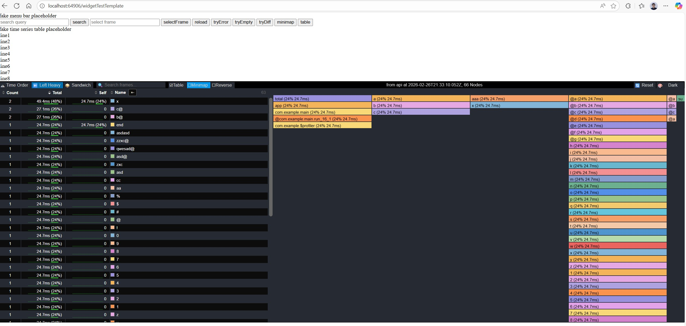
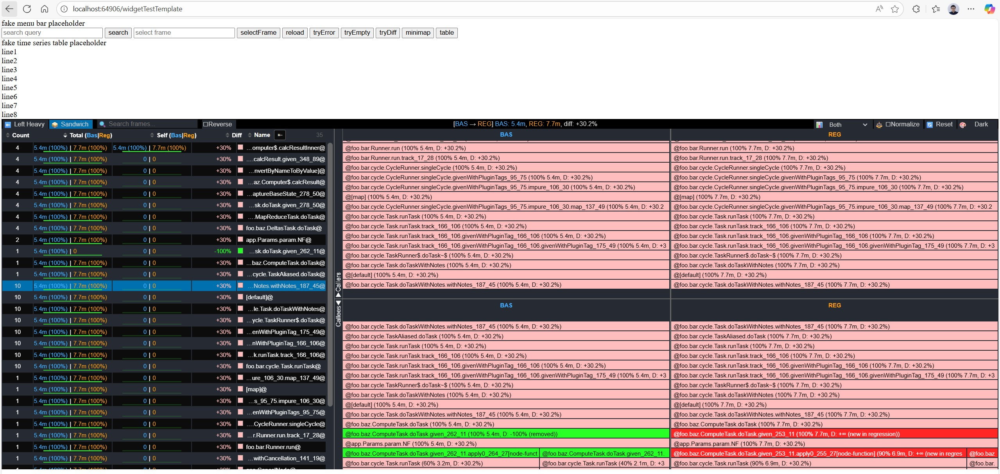

# Speedscope Widget

This repo adds a **Web Component API** (`<speedscope-widget>`) that wraps speedscope's flamegraph rendering into an embeddable, programmable widget. It is designed for host applications that need to display flamegraphs inline — without file browsing or drag-and-drop — by feeding profiling data directly via JavaScript.



## What's New

### Web Component: `<speedscope-widget>`

A custom element (`speedscopeWidget.ts`) that can be embedded in any HTML page:

```html
<speedscope-widget id="flame" style="width:100%;height:600px"></speedscope-widget>
<script type="module">
  import './dist/speedscopeWidget.js'
  const widget = document.querySelector('#flame')
  widget.setInput('root;main;foo 100\nroot;main;bar 200')
</script>
```

### Programmatic API (`window.speedscopeAPI`)

Once the widget is initialized, a global `speedscopeAPI` object is available:

| Method | Description |
|--------|-------------|
| `setSearchQuery(q)` | Highlight matching frames |
| `setViewMode(mode)` | Switch view (chrono, left-heavy, sandwich) |
| `setDisplayMiniMap(b)` | Toggle minimap |
| `setDisplayTable(b)` | Toggle table view |
| `setReverseFlamegraph(b)` | Reverse call stack direction |
| `setSelectedFrameName(name)` | Select a frame by name |
| `subscribe(fn)` | Listen to state changes |
| `reload(folded, unit)` | Load new profile data |

### Differential Flamegraph Support

Compare two profiles side-by-side with BAS (baseline) / REG (regression) diff mode. Includes color-coded diff highlighting and a normalize toggle for comparing profiles of different durations.

### Additional Features

- **Color schema adjustments** with expanded dark/light theme and diff-aware colors
- **UI enhancements** including new interactive functions and controls
- **Optimized rendering speed** for smoother flamegraph display and faster load times
- **UX improvements** across navigation, layout, and interaction patterns
- **Frame count column** in the method table (shows how many times a frame appears)
- **Resize-aware rendering** via `ResizeObserver` for embedding in dynamic layouts
- **Widget events**: `speedscope:ready`, `speedscope:error`, `speedscope:apiReady`
- **Standalone HTML export** via `npm run build-standalone`

## Files Added

| File | Purpose |
|------|---------|
| `src/speedscopeWidget.ts` | Web Component (`<speedscope-widget>`) |
| `src/widgetApi.ts` | Programmatic API (`window.speedscopeAPI`) |
| `src/widgetUtils.tsx` | Widget rendering utilities |
| `src/widgetApiLocalTestMain.ts` | Local test harness |
| `src/main.css` | Standalone CSS |
| `src/diff.json` | Sample diff profile for testing |
| `src/views/callee-flamegraph-view-reg.tsx` | REG callee flamegraph view |
| `src/views/inverted-caller-flamegraph-view-reg.tsx` | REG inverted caller view |

## Loading New Data

### Standard Speedscope JSON

To load a standard speedscope JSON profile, use the `reload` method with folded-stack formatted data:

```js
const widget = document.querySelector('#flame')

// Load from folded-stack string
widget.setInput('root;main;foo 100\nroot;main;bar 200')

// Or reload with new data at any time
window.speedscopeAPI.reload('root;main;baz 300\nroot;main;qux 400', 'microseconds')
```

### Reg Diff Mode JSON

To load a differential profile comparing baseline (BAS) vs regression (REG), provide a diff JSON object:

```js
const diffData = {
  bas: 'root;main;foo 100\nroot;main;bar 200',
  reg: 'root;main;foo 150\nroot;main;bar 180'
}

// Load diff mode data as JSON string
widget.setInput(JSON.stringify(diffData))
```

The diff mode will automatically color-code frames to show performance regressions and improvements between the two profiles.

## Standalone Demo

Build a self-contained HTML file with example profiler data that can be opened directly in a browser — no server required:

```
npm run build-demo
```

This generates `dist/speedscope-demo.html` with built-in sample profiles and a toolbar to switch between profiles and view modes. Double-click the file to open it.

## Publishing to npm

Use the publish script to bump version, build, and publish in one step:

```bash
# Bump patch version and publish
npm run publish-widget -- patch

# Bump minor version and publish
npm run publish-widget -- minor

# Set an exact version
npm run publish-widget -- 2.0.0

# Dry run (preview without publishing)
npm run publish-widget -- patch --dry-run

# Publish to a custom registry
npm run publish-widget -- patch --registry https://your-registry.com
```

The package is published as `speedscope-widget` with the widget entry point at `dist/speedscopeWidget.js`.

## Local Development

1. Install dependencies:
   ```
   pnpm install
   ```

2. Build and test the widget locally:
   ```
   npm run local
   npm run test
   ```
   Then open `http://localhost:64906/widgetTestTemplate.html`

3. Build the widget for production:
   ```
   npm run build
   ```

## Known Limitations

- **Optimized for speedscope JSON only**: This widget is currently optimized for the standard speedscope JSON format for best performance. Other profile formats remain untested and may not work as expected.
- This work focuses on the **widget embedding use case** and has not been integrated with speedscope's existing application-level test suite (`jest`). The snapshot tests may need updating to reflect the modified frame format and new fields.
- The original speedscope entry point (`src/speedscope.tsx`) and its file-import UI are **unchanged** and continue to work as before.
